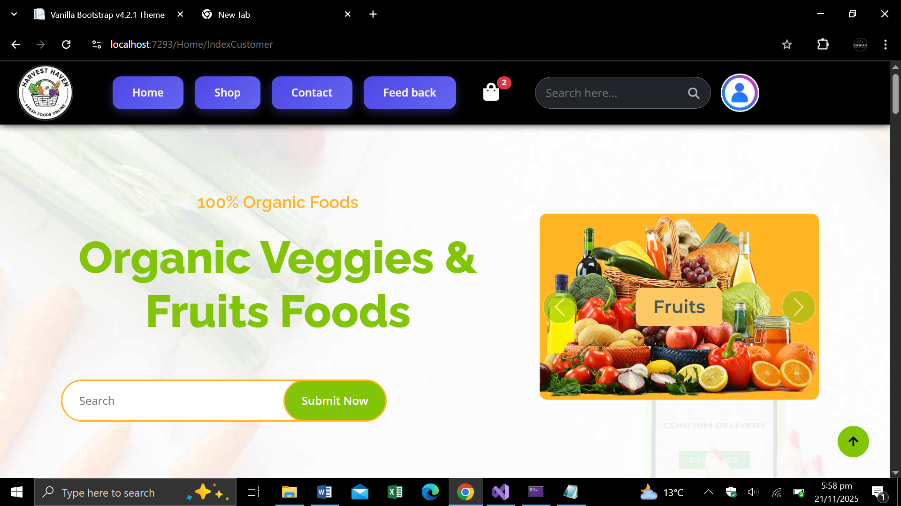
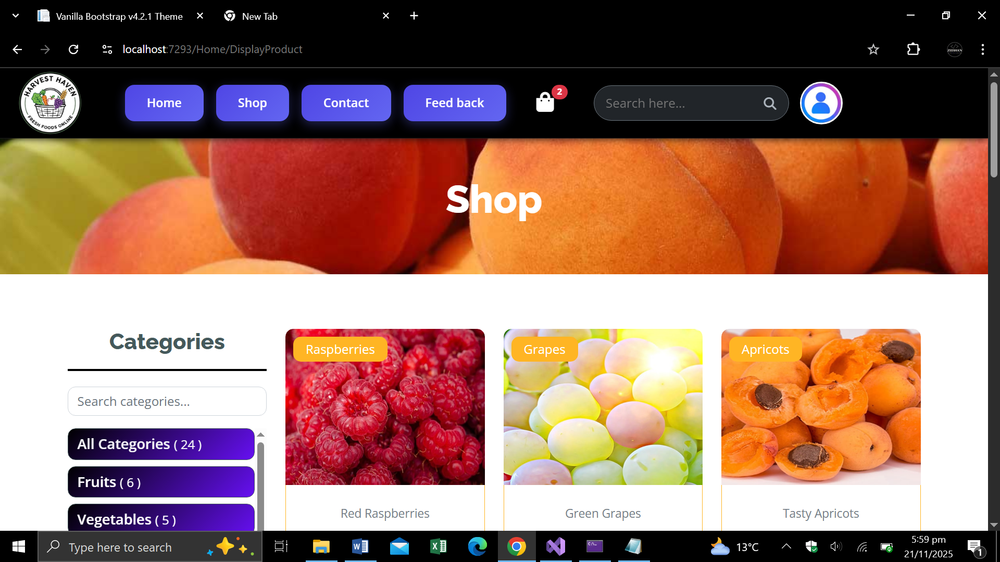
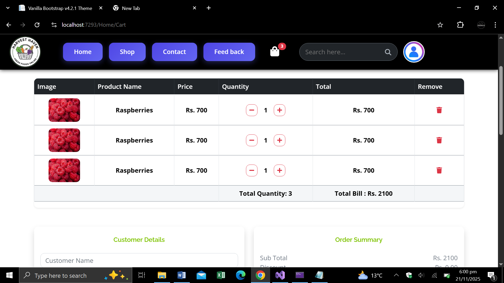
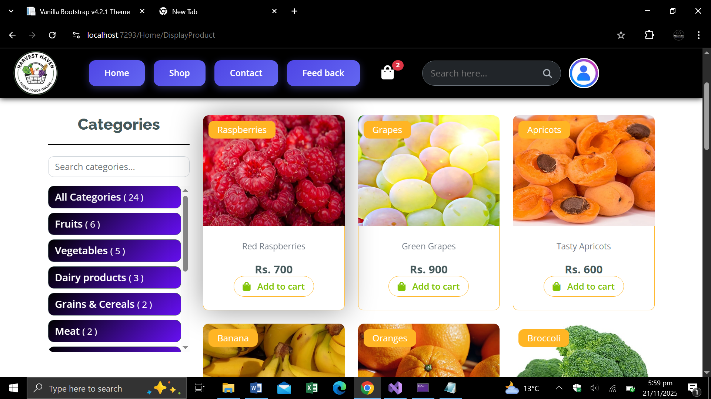
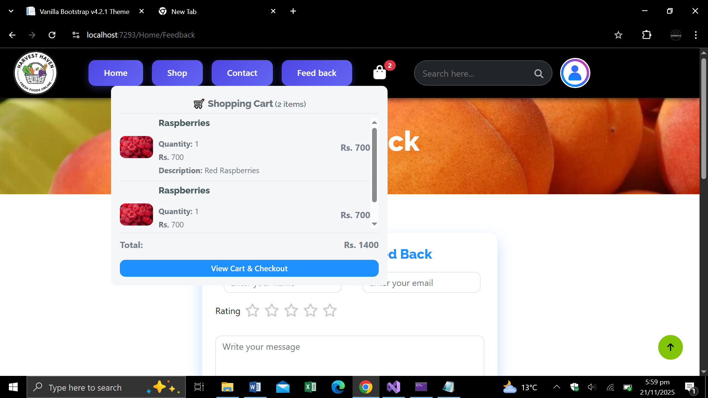
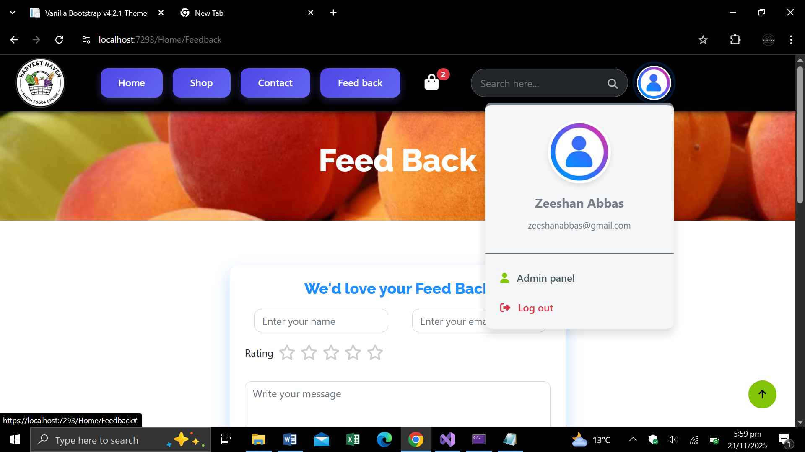
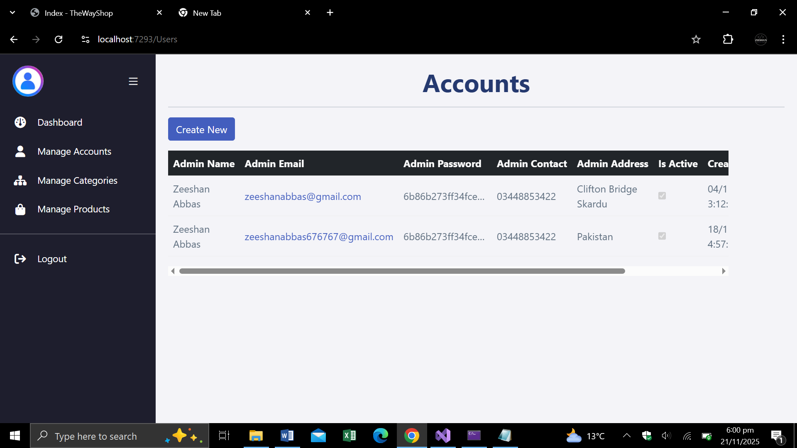

🍎  Organic Food Online E-Commerce 
Organic Food Online website is a full-featured e-commerce web application built with ASP.NET Core MVC. It allows users to browse and purchase fresh organic foods like fruits, vegetables, meat, and dairy. It includes a complete Admin Panel for managing the inventory and users.

🚀 Key Features
🛒 Customer Panel (Front-End)
•	Browse Products: View fresh food items categorized by Fruits, Vegetables, Meat, etc..
•	Search & Filter: Search for items and filter them by Category or Price Range.
•	Shopping Cart: Add items, update quantities, or remove items. The cart is saved in the session.
•	Checkout: Secure checkout process integrated with PayPal Sandbox.
•	User Accounts: Sign up and Log in to manage orders.
•	Feedback: Submit ratings and feedback about the service.

⚙️ Admin Panel (Back-End)
•	Dashboard: View real-time statistics (Total Accounts, Categories, and Products).
•	Manage Products: Add, Edit, or Delete products with image upload functionality.
•	Manage Categories: Create and organize product categories.
•	Manage Accounts: View and manage registered user accounts.

🛠️ Tech Stack
•	Framework: ASP.NET Core MVC (C#)
•	Database: Entity Framework Core (SQL Server)
•	Architecture: Repository Pattern (Generic Repository) for clean code.
•	Front-End: Bootstrap 5, jQuery, HTML5, CSS3.
•	Authentication: Custom Session-Based Authentication.

## 🗂️ Project Structure

### 🔹 Home Page

### 🔹 Shop Page

### 🔹 Carts View Page

### 🔹 Products Page

### 🔹 Shopping Bag

### 🔹 User Info

### 🔹 User Dashboard

### 🔹 User-Accounts

